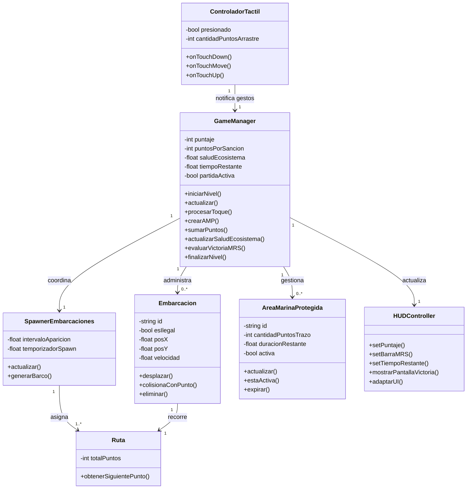

# Diagrama de Clases — EcoPatrulla-Marino

**Proyecto:** EcoPatrulla-Marino  
**Equipo:** Matheo Jaramillo Cardenas - Victor Manuel Magaña Perez  
**Versión:** 1.0  
**Fecha:** Noviembre 2026  

```mermaid
classDiagram
    class GameManager {
        -int puntaje
        -int puntosPorSancion
        -float saludEcosistema
        -float tiempoRestante
        -bool partidaActiva
        +iniciarNivel()
        +actualizar()
        +procesarToque()
        +crearAMP()
        +sumarPuntos()
        +actualizarSaludEcosistema()
        +evaluarVictoriaMRS()
        +finalizarNivel()
    }

    class SpawnerEmbarcaciones {
        -float intervaloAparicion
        -float temporizadorSpawn
        +actualizar()
        +generarBarco()
    }

    class Embarcacion {
        -string id
        -bool esIlegal
        -float posX
        -float posY
        -float velocidad
        +desplazar()
        +colisionaConPunto()
        +eliminar()
    }

    class Ruta {
        -int totalPuntos
        +obtenerSiguientePunto()
    }

    class AreaMarinaProtegida {
        -string id
        -int cantidadPuntosTrazo
        -float duracionRestante
        -bool activa
        +actualizar()
        +estaActiva()
        +expirar()
    }

    class ControladorTactil {
        -bool presionado
        -int cantidadPuntosArrastre
        +onTouchDown()
        +onTouchMove()
        +onTouchUp()
    }

    class HUDController {
        +setPuntaje()
        +setBarraMRS()
        +setTiempoRestante()
        +mostrarPantallaVictoria()
        +adaptarUI()
    }

    GameManager "1" --> "1" SpawnerEmbarcaciones : coordina
    GameManager "1" --> "0..*" Embarcacion : administra
    GameManager "1" --> "0..*" AreaMarinaProtegida : gestiona
    GameManager "1" --> "1" HUDController : actualiza
    ControladorTactil "1" --> "1" GameManager : notifica gestos
    SpawnerEmbarcaciones "1" --> "1..*" Ruta : asigna
    Embarcacion "1" --> "1" Ruta : recorre
```
